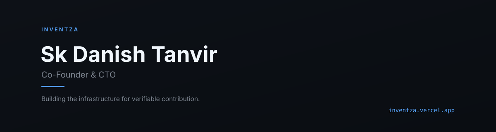

 

## What I'm building

**Inventza** is a platform where the only currency is a name put on a promise. No likes, no comments, no follower counts — every interaction is a commitment, a question, or evidence pinned to an exact point in someone's work.

Live preview: [inventza.vercel.app](https://inventza.vercel.app)

I own product architecture, engineering, infrastructure, and security across the platform. Two mechanics I designed and built:

**Evidence Pinning** — proof tied to an exact point in someone's actual work. Not a reaction. Not a vibe. A pin.

**Offer → Commitment → Outcome** — the lifecycle that replaces engagement metrics with real accountability, end to end.

All of it runs on a contract-first service architecture, built to scale from solo founder to a real engineering team without a rewrite at any stage.

 

## Focus

Product & system architecture · Frontend & backend engineering · Infrastructure & security · Contract-first API design

 

## GitHub

 

## Contact

[LinkedIn](https://www.linkedin.com/in/skdanisht/) · [skdanisht@gmail.com](mailto:skdanisht@gmail.com)

 

This README is intentionally scoped to current, verifiable work. Personal projects and interests outside of Inventza live on a separate portfolio site as they're ready.